# SiriusWeb Manuals
Create your custom Domain Specific Modelling Language (DSML) through SiriusWeb.
# Noted
This document is made for supporting people who are new to SiriusWeb and DSML. More detailed information and guideline are given in the [Obeo offical documentation](http://docs.obeostudio.com).
# Getting Started
[SiriusWeb](https://www.eclipse.org/sirius/sirius-web.html) is a open-source low-code platform to define custom web applications supporting your DMSLs.
## Environment
```Bash
# MacOS Ventura 13.2.1
# Safari 16.3
```
## Sign up
Before generating your own modelling project, you are required to ask for an Obeo account, which is avaliable for every one. To ask for an Obeo account, you should go to the [Signup page](https://demo.obeostudio.com/signup) and fill the form to provide required personal information (e.g, Username, Password...).
## Log in
Head to the [Login page](https://demo.obeostudio.com/login) and log in with your Username and Password.
## Create New Definition Project
To start your project, you should first create a new desctiption project.
+ Naviagate to the [Home page](https://demo.obeostudio.com/projects).
+ Click on the *'+ Blank project'*.

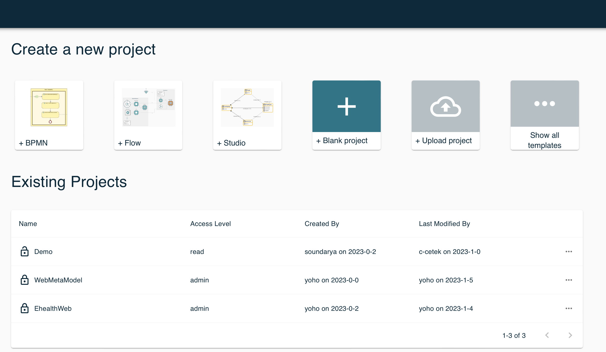 

+ Enter the project name.
+ Choose visualbility of your project.
+ Click on *Create*.

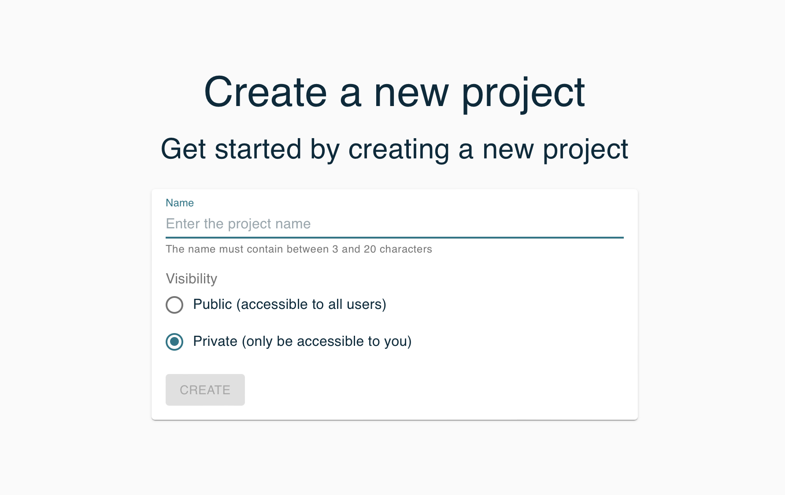 

Then you will be redirected to the newly created project. It will be initially empty; see following sections to learn how to use the project editor view to create your own models and representations.
## Create New Domain 
To create a new domain:
+ Head to the [Home page](https://demo.obeostudio.com/projects) 
+ Open the newly built desctiption project.
+ Underneath *Create a new Model* , choose *Domain* to create a new one.

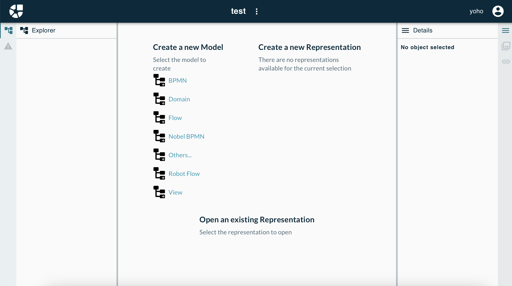

+ Underneath *Create a new Representation*, choose *Domain* to visualise new domain.

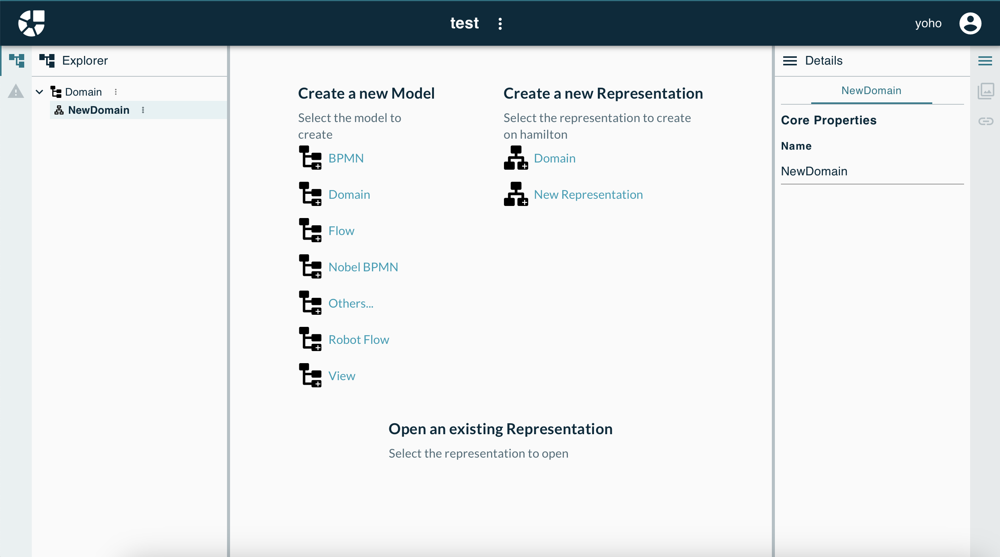

**Domain* is the root element which identifies your domain. Its only attribute is a name, which should be globally unique on a particular Obeo Studio server, and not contain any space or special character.

## Add New Elements
Inside a domain you can create *Entities* which represent the concepts in your domain. 
An *Entity* has a name, and zero or more super types. Besides, *Entity* can be abstract, meaning no concrete instances can be created from it.
To create a new *Entity*:

+ Hang your mouse over the panel to activate the tool bar, in which you can add a new *Entity*.

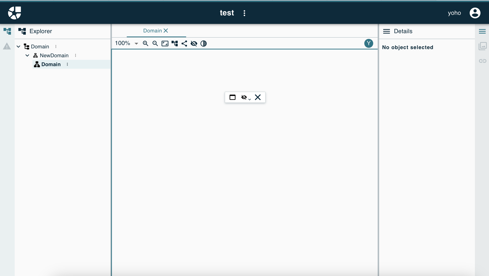

+ In right content box, you can modify the *Entity*.

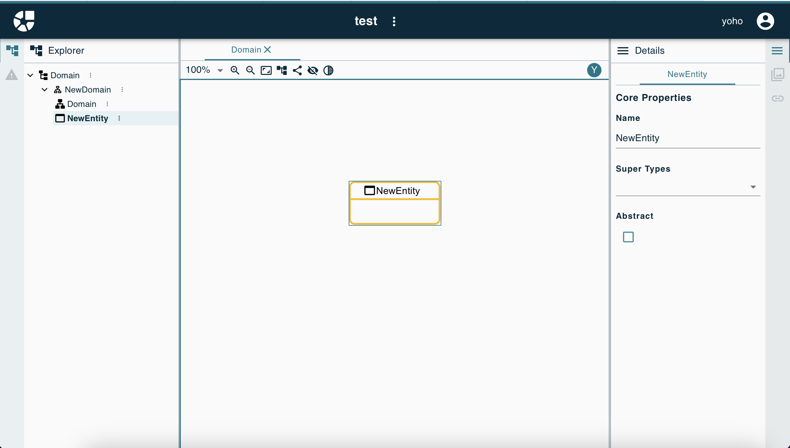

Inside an *Entity* you can create *Attributes* and *Relations*.

```bash
# Attribute is defined by an unique name, type and whether it is optional and many-valued 
# Relation is defined by unique name, type and whether it is a containment relation or not
```


To create a new *Attribute/Relation*:

+ Click on the *Entity* to activate the tool bar, in which you can add new attributes/relations to the *Entity*.

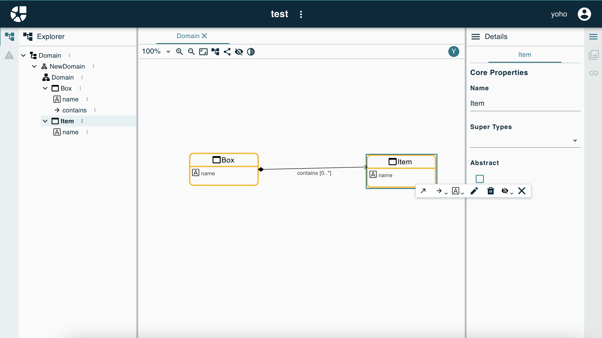

**DSML Sample**

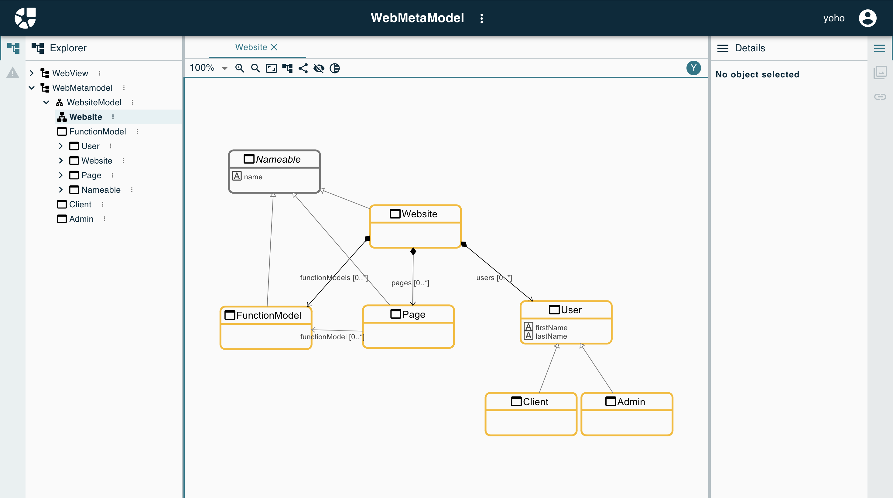

## Apply Custom DSML
Generate a new model based on the previously defined DSML:
+ Create a new desctiption project
  + Go to the [Home page](https://demo.obeostudio.com/projects) 
  + Create a blank project
  + Name the project
  + Choose visualbility
+ Create a new Model
  + Underneath *Create a new Model*, click on the *Other*
  + You can see a new domain named *New* in the left content box
+ Create a new root *Object* for *New*
  + Create new *Object* under *New*
  + Choose existing DSML
  + Choose root *Object* type
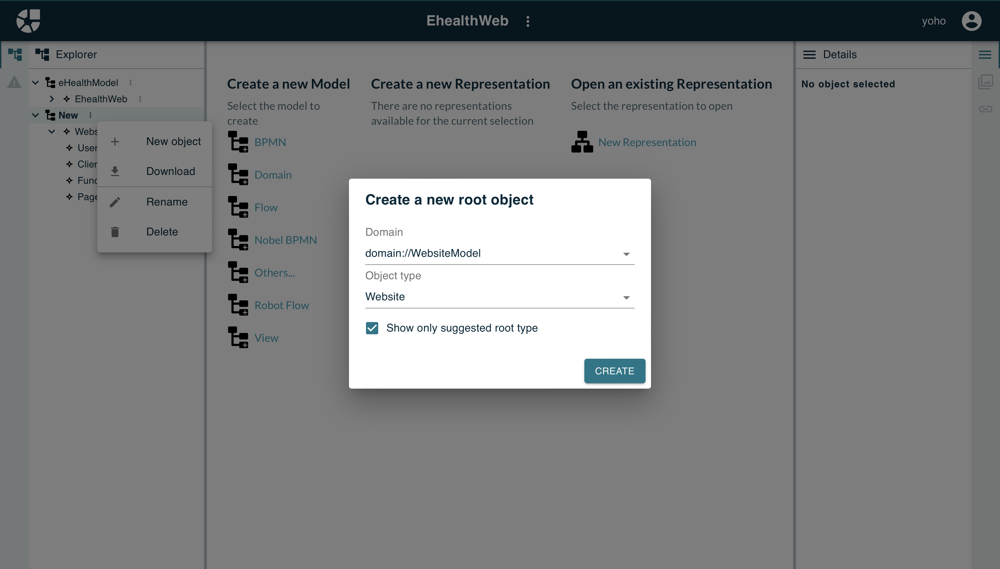

+ Create new child *Objects*
  + Create a new *Object* under the *root Object*
  + Choose *Object* type
  + Edit *Object* details in right content box
  

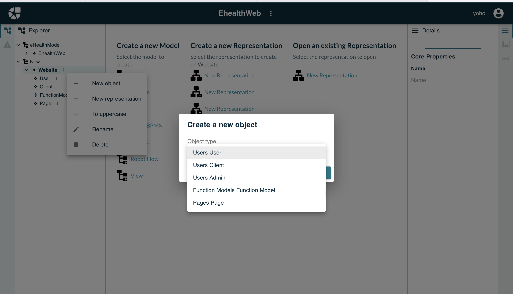

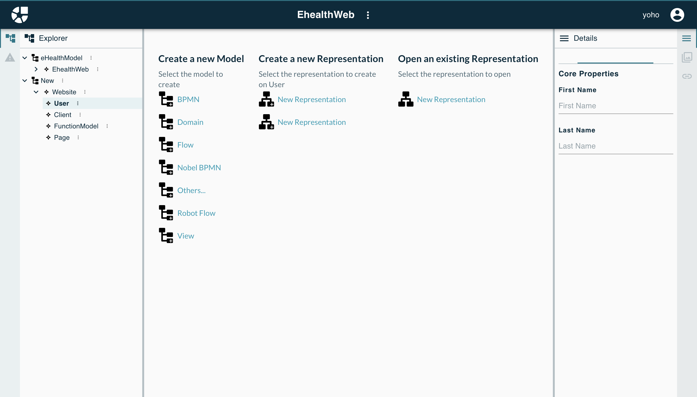

## Generate View for DSML
+ Go to the [Home page](https://demo.obeostudio.com/projects)
+ Open the DSML desctiption project
+ Create new view
  + Underneath *Create a new Model*, click on the *View*
  + You can see a new *View* in the left content box
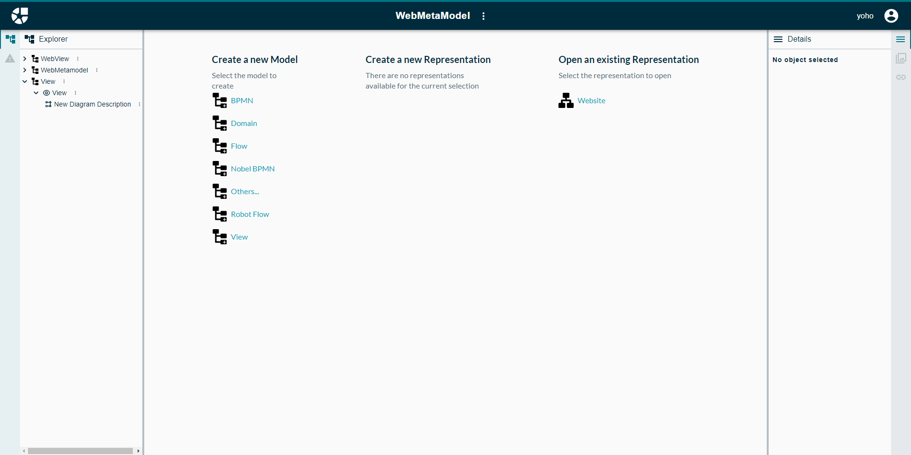

+ Customize View
  + Rename the View. 
  + Add Domain type. Domain type should follow Acceleo Query Language (AQL) rules, for more details: [Acceleo Documentation](https://www.eclipse.org/acceleo/documentation/aql.html).
  + Add child Objects. SiriusWeb currently only supports Node and Edge notation
  + Add Domain Type of child Object. 
  + Edit Semantic Candidates Expression to map the notation with target Entity.
  + Add Label Expression.
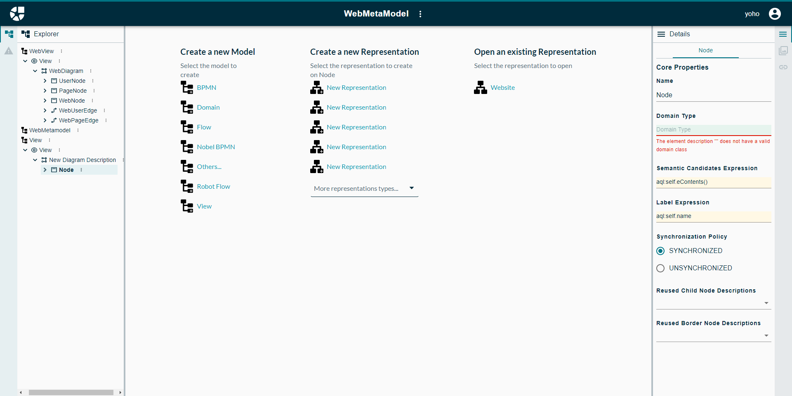

+ Apply Custom View
  + Go to model description project
  + Add new representation for root Object
**View Sample**
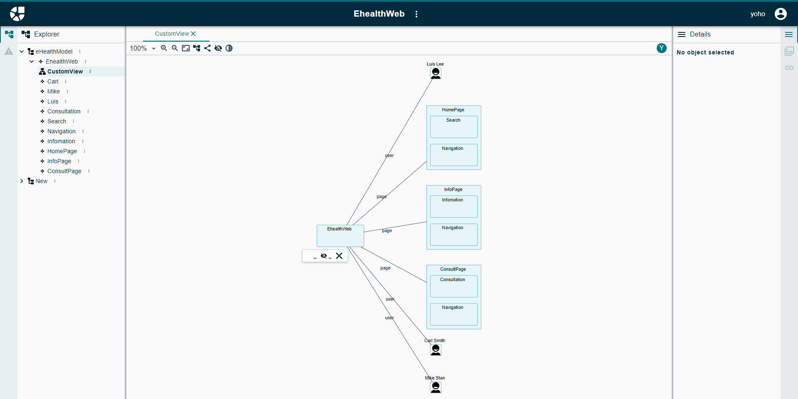

# Personalisation
SiriusWeb allows users to simply customise node description by images.
## Upload Images
Head to the DSML description project, find the project settings in the top of the panel. Click on the settings and find *Images*, in which users can upload images into this project as they wish.
## Apply Images
Go back to the DSML description project, find node description created before. Delete its child file starting with '#', and create a new child object named *Style Image* for this node. 

Now, you can find newly added images in *Shape* of the new child object and assign one of them to this node. 

After then, if you go back to the model description project, and opne the representation, you can see square node has been replaced by image.

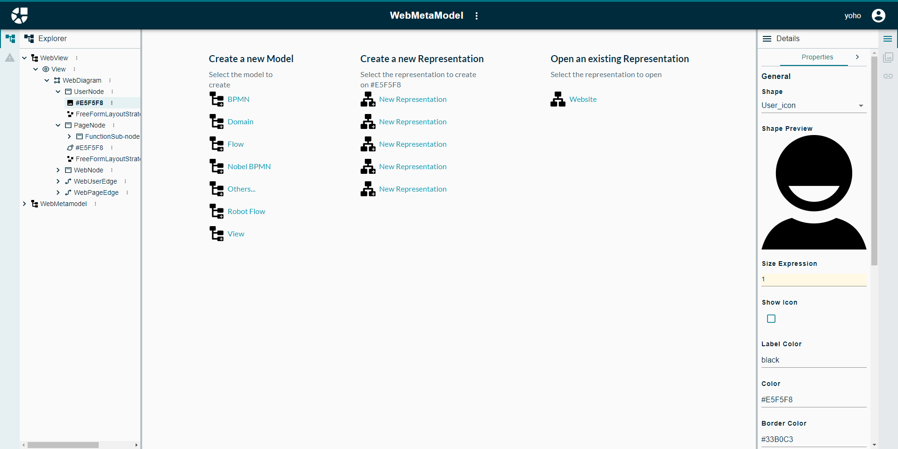

# End
Thanks to Eclipse Foundation. If you need more details about SiriusWeb, please check out [Sirius|Home](https://www.eclipse.org/sirius/).
